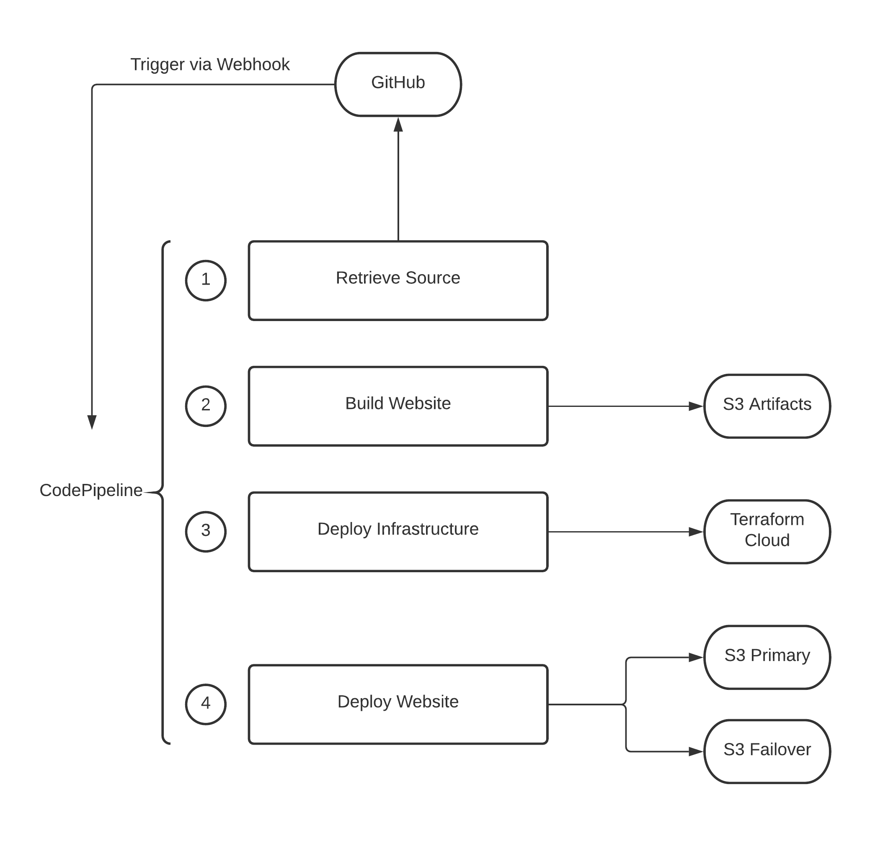

# Oram.co website

## Plan

Vue and Tailwind based website, hosted on AWS. IaC with Terraform, CICD with CodePipeline. 

Site contents - Simple about (home), links (navbar) and resume. Private pages for build status and links to various systems and tools needed for daily work.

## Project Layout

### CICD

The [./CICD](./CICD) folder hosts all the Terraform necessary to instantiate our automation pipeline. The templates in this folder deploy AWS CodePipeline for a given repo, and that CodePipeline will be triggered by GitHub commit to build and push updates to infrastructure and code.

> Note: 
There is an expectation that the CICD Terraform rarely changes. When it does, you may need to manually disable CodePipeline so you can deploy the CICD update before build automation starts and potentially conflicts.

All deployments of CICD should be done manually using the following steps.

1. Disable CodePipeline by manually deactivating the Webhook trigger using the AWS CLI or Console.
2. Commit and push (dev branch) or merge (Main branch)
3. In the Terraform Cloud Console
    1. Queue Plan
    2. Evaluate plan
    3. If approprate, Apply plan
4. Re-enable the webhook for CodePipeline and manually start a "Release Change"

## Services Used and Dependencies

[Terraform Cloud](https://app.terraform.io) - Used to host Terraform state; Build and apply Terraform plans.

